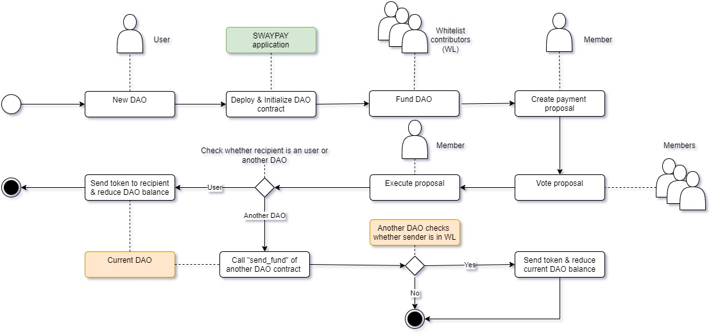
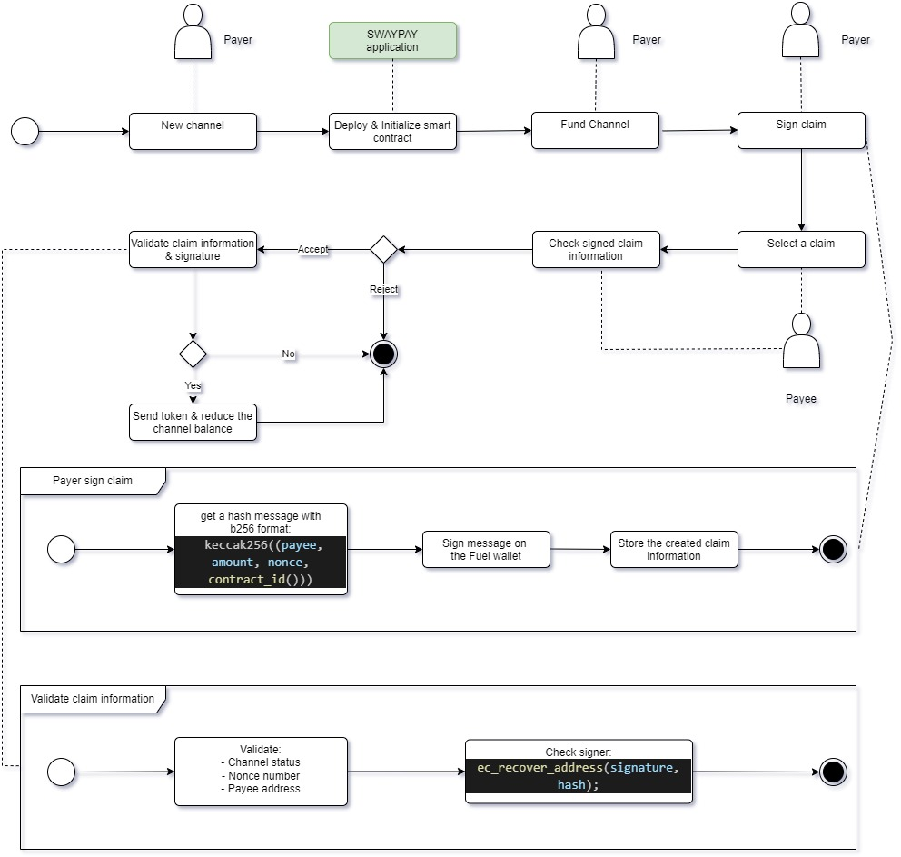

# Project Name: SWAYPAY

## Introduction

SWAYPAY, operating on the FUEL testnet, revolutionizes DAO creation, eliminating coding requirements for organizations. Seamless payments to users and other DAOs are facilitated through Payout and Funding proposals, backed by transparent voting. Our platform offers Crypto streaming and Payment channels for real-time transactions with minimal gas fees. With decentralized contract deployment for each DAO, Stream, or Channel, SWAYPAY ensures secure and efficient fund management. 

Our vision extends beyond payments; we plan to integrate SWAYPAY into remote jobs markets, empowering users with transformative features.

## Table of Contents

1. Overview
2. Key Features
3. How SWAYPAY Works
    - DAO & Payment Management
    - Crypto Streaming
    - Payment Channels
4. Use Cases
5. Technical Implementation
6. Future Developments
7. Conclusion

## 1. Overview
SWAYPAY aims to offer payment solutions catering to both DAOs and Individuals. Our primary target audience consists of FUEL users seeking seamless payroll, funding, and vesting solutions. By providing these services, we strive to contribute to the growth and expansion of the FUEL ecosystem.

## 2. Key Features
### DAO Creation without Coding:
SWAYPAY enables organizations to effortlessly create DAOs by providing an intuitive interface for configuring DAO parameters, defining governance rules, and establishing tokenomics. This eliminates the complexities of coding, making it accessible to a broader range of users.
### Transparent Governance with Voting Mechanism:
Within each DAO, SWAYPAY allows users to propose Payouts and Funding requests. The community participates in a democratic voting process to approve or reject these proposals, ensuring transparency and effective fund management.
### Seamless Payments and Payouts:
SWAYPAY facilitates seamless payments to individual users and other DAOs, both internally and externally. This feature fosters collaboration and financial interactions within the FUEL ecosystem.
### Crypto Streaming:
SWAYPAY introduces Crypto streaming, a cutting-edge feature that enables real-time payments based on continuous streams of funds. This dynamic payment method suits various use cases, such as subscription-based services.
### Payment Channels for Efficiency:
Leveraging Payment channels, SWAYPAY ensures near-instantaneous and cost-effective transactions for users. By reducing gas fees, this feature is especially advantageous for microtransactions and frequent transfers.
### Decentralized Contract Architecture: 
Each DAO, Crypto Stream, or Payment Channel in SWAYPAY is deployed as a separate contract on the FUEL testnet. This decentralized architecture ensures enhanced security and mitigates risks, as no central contract holds all the funds.

## 3. How SWAYPAY Works
### DAO & Payment Management
The primary flow of DAOs and Payment proposal management is as follows:

Additionally, the application offers several other features, including:

- Adding and removing members
- Joining and leaving open DAOs
- Updating whitelist contributors
- Accessing DAO and Treasury statistics.

### Crypto Streaming

The primary flow of a Stream is as follows:

Additional features include:
- Assigning privileges for canceling and transferring streams.
- Cancelling streams.
- Transferring streams.

To ensure fairness to both parties, users must possess the qualified assigned privilege when canceling or transferring a stream. In such cases, the remaining amount will be calculated and transferred to the recipient or sender accordingly. These measures guarantee a balanced and equitable user experience for all participants.

### Payment Channels

This is an MVP implementation for the payment channel concept. However, it still requires improvement to address critical security issues.

## Usecases

SWAYPAY can be used for the following purposes:

- Managing DAO Treasury: It allows payout to individuals or funding other organizations through transparent proposals and voting, facilitating efficient financial management within DAOs.

- Paying Freelancer Salaries and Subscription Services: SWAYPAY supports crypto streaming for payments, enabling freelancers to receive payments in real-time for their services or subscriptions. This feature provides security and transparency, protecting users in the labor market.

- Transaction and Invoicing: SWAYPAY facilitates multiple transactions between parties, such as buyers and service providers. Each payment is confirmed and accepted through a claim, akin to a traditional invoice. Additionally, it is suitable for micropayments, reducing transaction fees and costs for payers and other payment engines built on blockchain.

## Technical implementation

To build SWAYPAY, we followed these steps:
- Analyzed the FUEL ecosystem and hackathon requirements to understand the project scope.

- Developed a comprehensive UI/UX concept to outline the application's requirements and functionalities.

- Learned and utilized the SWAY programming language to write smart contracts, enabling efficient contract development.

- Implemented autotest scripts to ensure the robustness and reliability of the most crucial features.

- Designed an offchain database initially considering indexer integration, but due to technical challenges, opted for a cloud-based MongoDB solution.

- Integrated SWAYPAY with fuels-ts and wallet SDK to facilitate smooth interactions with the FUEL ecosystem.

- Wrote the core components of SWAYPAY, laying the foundation for its various functionalities.

- Progressively completed the planned features according to our development roadmap.

## Future Development

At this phase, SWAYPAY serves as an MVP that represents the core ideas of our project. Due to the short duration of the hackathon, there is ample room for improvement and further enhancements to be made in future iterations of SWAYPAY.

Here are the planned enhancements and features for SWAYPAY:

1. Implement gasless deployment and initialization for all smart contracts, making it easier for users to interact with the platform.
2. Introduce token-based DAOs, providing greater flexibility and utility within the decentralized ecosystem.
3. Expand proposal types to cover a wide range of payment and governance scenarios, enhancing the platform's functionality.
4. Support parent and children DAOs architecture to facilitate hierarchical organization structures and collaborations.
5. Introduce batch streams and channels deployment, streamlining the process for multiple transactions.
6. Implement a personal invoice system for users, enhancing transparency and ease of payment management.
7. Introduce a user's address book for convenient and efficient transactions between familiar parties.
8. Implement a user-friendly naming system to simplify SWAYPAY user addresses and improve user experience.
9. Transition from offchain Database to an indexer-based solution for enhanced scalability and data management.
10. Integrate Oracle services to bring real-world data onto the blockchain, expanding use cases and applications.
11. Add support for more tokens, increasing the diversity of assets available on SWAYPAY.
12. Introduce support for fiat currencies, bridging the gap between traditional finance and the decentralized ecosystem.
13. Conduct a thorough audit of all smart contracts to ensure security and reliability.
14. Develop APIs and SDKs to enable easy integration and interaction with SWAYPAY's features.
15. Conduct research and expand business use cases to identify new opportunities and potential areas for growth.

## Conclusion

During the SWAY Summer Hackathon, we had an incredible experience exploring the possibilities with SWAYPAY. FUEL, as a blockchain platform, exhibits tremendous potential to become a major player in the industry. We are thrilled to have contributed, even in a small way, to the success of the FUEL ecosystem through SWAYPAY.

We extend a heartfelt thanks to the FUEL open-source community and the dedicated support from the FUEL community. Without their invaluable assistance, we wouldn't have been able to complete this product within the given time limitations.

We look forward to further contributing to the growth and success of the FUEL ecosystem and are excited about the future possibilities with SWAYPAY.